## Name-based Virtual Host Support
IP-pohjaiset vaativat jokaiselle verkkosivustolle oman IP-osoitteen. Nimipohjaiset hyödyntävät asiakkaan HTTP-otsikkoa ja mahdollistavat useita verkkosivustoja samalla IP-osoitteella.

Apache valitsee ensin IP-pohjaisesti sopivimman isännän ja vasta sitten vertailee palvelinnimiä (ServerName, ServerAlias).
Ensimmäinen määritelty virtuaali-isäntä toimii oletuksena, jos tarkkaa osumaa ei löydy.

Jokaiselle verkkotunnukselle luodaan <VirtualHost>-lohko, jossa määritellään ServerName ja DocumentRoot. ServerAlias-direktiivi mahdollistaa useiden nimien yhdistämisen yhteen isäntään.

## Multiple Websites to Single IP Address
Apache mahdollistaa useiden verkkosivustojen isännöinnin yhdellä IP-osoitteella.
Asennus ja konfigurointi vaatii komentorivin käyttöä.

Päävaiheet:
Apache2-asennus ja oletussivun luonti.
Uuden virtuaali-isännän määrittäminen (/etc/apache2/sites-available -hakemistossa).
Sivuston testaus paikallisesti curl-komennolla.
DNS-nimen voi simuloida muokkaamalla /etc/hosts -tiedostoa.
Useiden virtuaalisten isäntien lisääminen yhdelle palvelimelle on mahdollista.

# Sivun luonti

"sudo systemctl status apache2" Komennolla tarkistin käynnistämällä ja varmistamalla, että palvelin toimii.

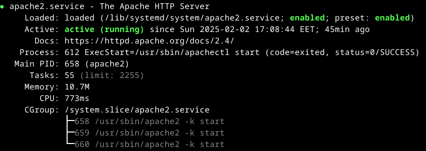 

Selaimessani tarkistin localhost sivun avaamalla, että palvelin vastaa. Viimeistä oppitunnista on jo tehty joku sivu, mutta poistan sen myöhemmin, jotta pystyn tehdä uuden.

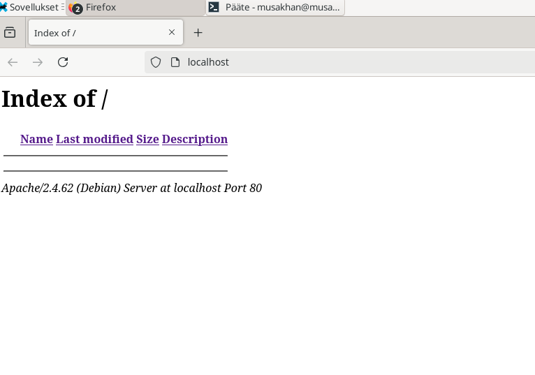 

## Lokit

Kun verkkosivu latautuu, Apache tallentaa pyyntöjen tiedot kahteen lokitiedostoon:

Access log (access.log): Kirjaa kaikki HTTP-pyynnöt.
Error log (error.log): Kirjaa virheet ja ongelmat palvelimella.

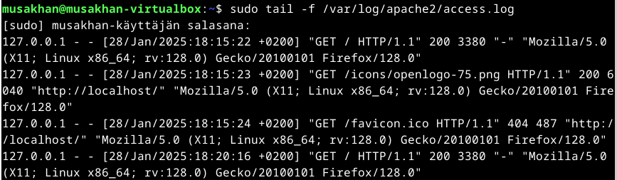

Selitys:

127.0.0.1: Asiakkaan IP-osoite (localhost).
[28/Jan/2025:18:15:22 +0200]: Pyyntö tehtiin 28. tammikuuta 2025 kello 18:15 UTC+2.

"GET / HTTP/1.1": Asiakas pyysi juurisivua HTTP/1.1-protokollalla.

200: HTTP-vastauskoodi (onnistunut pyyntö).

3380: Vastaavan tiedoston koko (tavuina).

"Mozilla/5.0...": Käytetty selain (Firefox 128.0) ja käyttöjärjestelmä (Linux x86_64).

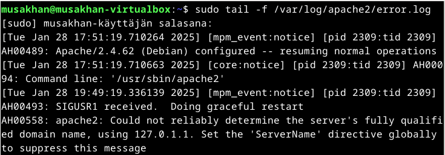

Selitys:

[core:notice]: Apache-moduuli (core) antaa ilmoituksen.

AH00094: Apache-tapahtumatunniste.

Command line: '/usr/sbin/apache2': Apache käynnistettiin komennolla /usr/sbin/apache2.

[mpm_event:notice]: Apache Multi-Processing Module (MPM) käsittelee tapahtumaa.

SIGUSR1 received: Palvelin vastaanotti SIGUSR1-signaalin, mikä johtaa "sulavaan uudelleenkäynnistykseen".

Doing graceful restart: Apache uudelleenkäynnistyy katkaisematta olemassa olevia yhteyksiä.

## Etusivun uusiminen

Listan olemassa olevat virtual hostit

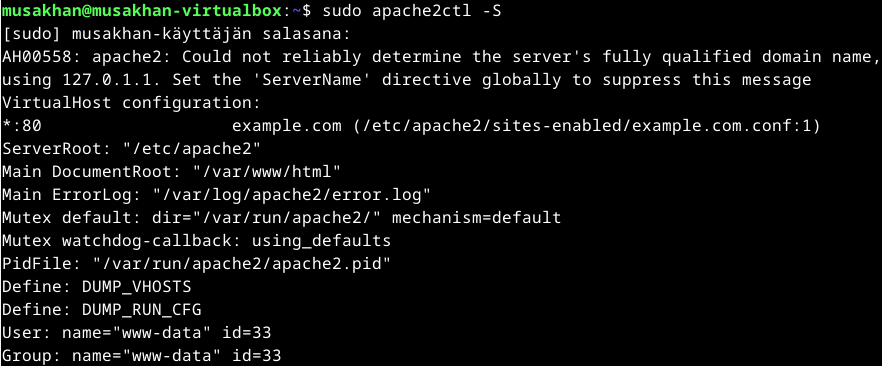

Poistan viimeinen sivu example.com, koska tein väärin sen. Oletussivusto on jo poistettu. Lataan apache2 uudelleen.

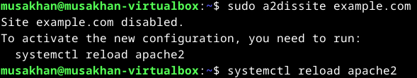

Olen luonut uuden hakemiston ja HTML-tiedoston Apache-palvelimen julkaisua varten. 

Komento "mkdir -p" luo hakemiston "hattu.example.com" käyttäjän kotihakemistoon "public_html"-kansion alle.
"-p-"vaihtoehto varmistaa, että myös mahdolliset välimatkan kansiot luodaan, jos niitä ei vielä ole olemassa.

Komento "echo" tuottaa yksinkertaisen HTML-dokumentin, joka tallennetaan tiedostoon index.html hakemistossa.

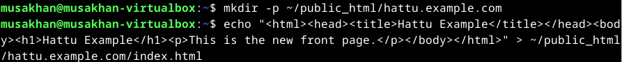

Käytän asetustiedoston muokkaamiseen nano-tekstieditoria komennolla ja sen jälkeen kirjoitan sinne seuraava sisältö.

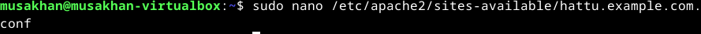
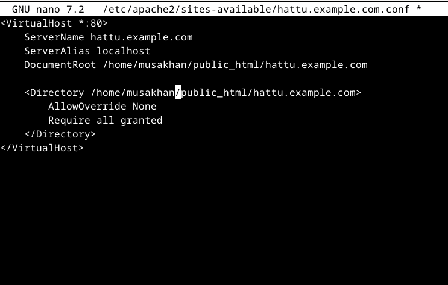

Täällä määritetään virtuaalisivuston, joka käyttää porttia 80 (HTTP-protokolla), pääverkkotunnukseksi hattu.example.com, että sivuston sisältö löytyy hakemistosta /home/musakhan/public_html/hattu.example.com.

AllowOverride None: Tämä estää .htaccess-tiedostojen käyttämisen hakemistossa.

Require all granted: Tämä sallii pääsyn kaikille käyttäjille kyseiseen hakemistoon.

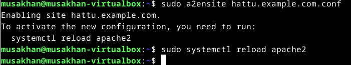

Aktivoidaan uuden konfiguraation ja lataan Apache-palvelimen uudelleen.

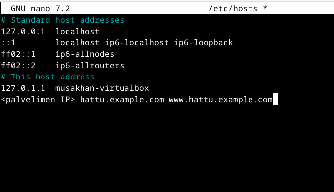

Muokkaan paikallisen koneensa hosts-tiedostoa, jotta verkkotunnus hattu.example.com voidaan osoittaa palvelimen IP-osoitteeseen.

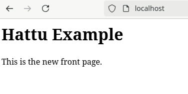

Ja etusivu on toimimassa tähän hetkeen. 

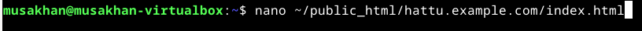
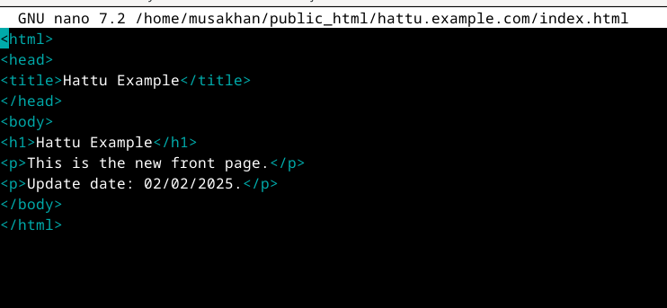

Pystyn muokkaamaan verkkosivuston etusivua tiedostossa index.html ilman "sudo" "nano" edittorilla.

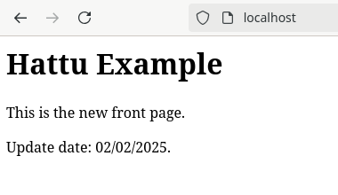

Ja tässä paivitetty etusivu on näkyvissä.

## Curl kommennot

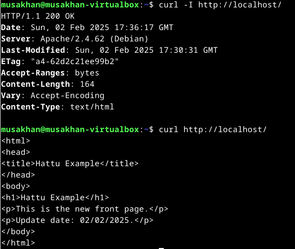

curl -I näyttää palvelimen palauttamat HTTP-otsakkeet, jotka sisältävät tärkeitä tietoja, kuten palvelimen version, aikaleiman ja tiedoston tyypin. Otsakkeet auttavat ymmärtämään, miten palvelin ja selain toimivat yhdessä (esim. välimuistin hallinta, tiedostotyypin tunnistus).

curl puolestaan lataa koko sivun sisällön (HTML tai muu).

## Lähteet

Karvinen 2018: https://terokarvinen.com/2018/04/10/name-based-virtual-hosts-on-apache-multiple-websites-to-single-ip-address/
Kong Yang and Lisa Tagliaferri 2022: https://www.digitalocean.com/community/tutorials/how-to-set-up-apache-virtual-hosts-on-ubuntu-20-04
